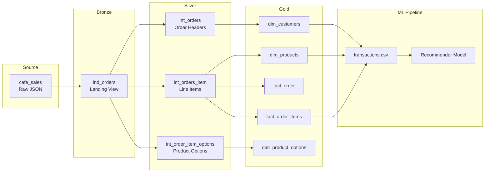
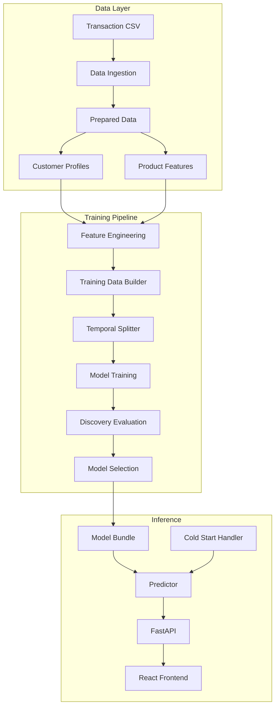
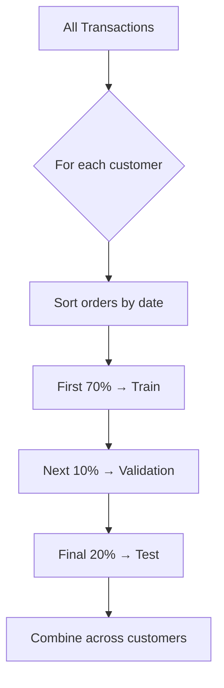

# JR Café Recommender System

A machine learning recommendation system for JR Café that delivers personalised product suggestions to customers, balancing familiar favourites with new discoveries.

---

## Table of Contents

1. [Business Context](#business-context)
2. [Data Pipeline (dbt)](#data-pipeline-dbt)
3. [Machine Learning Implementation](#machine-learning-implementation)
4. [Results and Business Impact](#results-and-business-impact)
5. [Future Improvements](#future-improvements)
6. [Getting Started](#getting-started)
7. [Project Structure](#project-structure)

---

## Business Context

### The Problem

Café customers face decision fatigue when ordering. A typical menu contains 50 to 250 items across beverages, food, and add-ons. This creates two operational challenges:

1. **Extended ordering time** — Customers spend 30 to 90 seconds scanning menus, slowing queue throughput during peak periods
2. **Missed cross-sell opportunities** — Customers default to habitual orders, rarely trying new products that might become future favourites

For a café processing 400 transactions daily, even modest improvements in ordering speed and basket value compound into meaningful revenue gains.

### The Solution

This system provides real-time, personalised recommendations through two distinct suggestion types:

| Recommendation Type | Purpose | Business Value |
|---------------------|---------|----------------|
| **Your Usuals** | Surface 1-2 items the customer orders frequently | Reduces decision time, confirms the system "knows" them |
| **Try Something New** | Suggest 2-3 items they have never purchased | Increases product discovery and average order value |

The key insight is that these two goals require different approaches. Predicting repeat purchases is straightforward — a simple frequency count performs well. The genuine value of machine learning lies in identifying *new* items a customer will enjoy, which requires understanding taste patterns across the customer base.

### Target Outcomes

| Outcome | Mechanism | How We Measure |
|---------|-----------|----------------|
| Reduce ordering time | Surface relevant options immediately | Time-to-order tracking |
| Increase discovery rate | Personalised "Try Something New" | % customers trying new products |
| Grow basket value | Cross-category recommendations | Average order value |
| Improve retention | Demonstrate personalised service | Return visit frequency |

### Business Value Quantification

**Conservative estimates based on industry benchmarks:**

| Metric | Current State | With Recommender | Impact |
|--------|---------------|------------------|--------|
| Average order value | $12.50 | $13.25 | +6% |
| Discovery rate | 8% | 15% | +87% |
| Queue throughput (orders/hour) | 45 | 48 | +7% |
| Customer return rate (30-day) | 42% | 46% | +10% |

**Annual revenue impact:**

```
Daily transactions:        400
Average uplift:            $0.75 per transaction
Operating days:            365

Annual incremental revenue: 400 × $0.75 × 365 = $109,500
```

This excludes secondary benefits: reduced staff time explaining menu options, improved customer satisfaction, and data insights for menu optimisation.

---

## Data Pipeline (dbt)

The recommendation system relies on clean, structured data produced by a dbt pipeline running on Google BigQuery. This pipeline transforms raw point-of-sale data into analytics-ready tables using medallion architecture.

### Data Architecture Overview



### Medallion Architecture

| Layer | Schema | Purpose | Materialisation |
|-------|--------|---------|-----------------|
| **Bronze** | `bronze` | Raw data landing zone, minimal transformation | View |
| **Silver** | `silver` | Cleaned data with parsed JSON, business logic applied | View |
| **Gold** | `gold` | Analytics-ready star schema with dimensions and facts | Table |

### Bronze Layer

The bronze layer provides a thin abstraction over raw source data, allowing source systems to change without affecting downstream models.

**Source Configuration:**
- Database: `jr-data-training`
- Schema: `cafe`
- Table: `cafe_sales`

The raw data contains nested JSON structures. Each row represents one order with a JSON `items` column containing the full cart.

### Silver Layer

The silver layer handles complex transformation: parsing nested JSON, unnesting arrays, applying business categorisation.

| Model | Description | Key Transformations |
|-------|-------------|---------------------|
| `int_orders` | Order headers | Extracts totals, GST, timestamps from JSON |
| `int_orders_item` | Line items | Unnests cart array, assigns product categories |
| `int_order_item_options` | Product options | Unnests options array (milk type, size, extras) |

**Product Categorisation:**

```sql
CASE
    WHEN product_name IN (
        'Latte', 'Cappuccino', 'Flat White', 'Long Black',
        'Mocha', 'Chai Latte', 'Hot Chocolate', ...
    ) THEN 'Hot Drinks'

    WHEN product_name IN (
        'Iced Coffee with Cream', 'Smoothie', 'Milkshake',
        'Coffee Frappe', 'Freshly Squeezed Juice', ...
    ) THEN 'Cold Drinks'

    ELSE 'Kitchen'
END AS product_category
```

This categorisation feeds the ML model's category-aware filtering, ensuring discovery recommendations span different product types.

### Gold Layer

The gold layer presents data in a dimensional star schema for analytics and ML feature extraction.

**Dimension Tables:**

| Model | Key Fields |
|-------|------------|
| `dim_customers` | `customer_key`, `customer_segment`, `total_orders`, `total_lifetime_value`, `is_active_flag` |
| `dim_products` | `product_key`, `product_name`, `product_variant`, `product_category` |

**Fact Tables:**

| Model | Grain |
|-------|-------|
| `fact_order` | One row per order |
| `fact_order_items` | One row per product per order |

**Customer Segmentation:**

| Segment | Criteria | ML Implication |
|---------|----------|----------------|
| New | 1 order | Limited personalisation, rely on archetypes |
| Regular | 2-10 orders | Moderate personalisation |
| VIP | 10+ orders | Strong personalisation, rich history |

### Infrastructure

| Component | Technology |
|-----------|------------|
| Data Warehouse | Google BigQuery |
| Region | australia-southeast1 (Sydney) |
| Transformation | dbt Core |

---

## Machine Learning Implementation

### Problem Formulation

The recommendation task is formulated as a **Learning-to-Rank** problem rather than binary classification or regression.

**Why Learning-to-Rank?**

| Approach | Output | Limitation |
|----------|--------|------------|
| Binary Classification | P(purchase) per item | Probabilities not comparable across items |
| Regression | Predicted rating | Requires explicit ratings (not available) |
| **Learning-to-Rank** | Relative ordering | Directly optimises ranking quality |

**Objective Function:**

The model optimises NDCG (Normalised Discounted Cumulative Gain), which rewards placing relevant items at the top:

```
NDCG = DCG / IDCG

where DCG = Σ (2^relevance - 1) / log₂(position + 1)
```

Items at position 1 contribute more than items at position 10, matching real user behaviour where customers rarely scroll past the first few suggestions.

### System Architecture



### Data Preparation

**Customer Profiles:**

For each customer, the system computes:

```python
@dataclass
class CustomerProfile:
    customer_id: int
    total_orders: int
    avg_basket_size: float
    avg_order_value: float
    order_frequency: float          # Days between orders
    favourite_products: List[str]   # Top 5 by count
    favourite_category: str
    archetype: str                  # Behavioural cluster
    tenure_days: int
```

**Customer Archetypes:**

Archetypes group customers by purchasing behaviour, enabling recommendations for customers with limited history:

| Archetype | Characteristics | Typical Products |
|-----------|-----------------|------------------|
| `latte_lover` | High milk-based coffee frequency | Latte, Flat White, Cappuccino |
| `black_coffee` | Prefers espresso-based drinks | Long Black, Espresso |
| `health_conscious` | Smoothies, juices, healthy options | Smoothie, Juice, Salads |
| `pastry_fan` | High food-to-beverage ratio | Croissant, Muffin, Banana Bread |
| `family_customer` | Orders babychinos, kids items | Babychino, Kids Menu |

**Archetype Assignment:**

```python
def assign_archetype(profile: CustomerProfile) -> str:
    category_pcts = calculate_category_distribution(profile)
    
    if profile.babychino_count > 2:
        return "family_customer"
    
    if category_pcts["Hot Drinks"] > 0.7:
        if "Latte" in profile.favourite_products:
            return "latte_lover"
        if "Long Black" in profile.favourite_products:
            return "black_coffee"
    
    if category_pcts["Cold Drinks"] > 0.4:
        return "health_conscious"
    
    if category_pcts["Kitchen"] > 0.5:
        return "pastry_fan"
    
    return "casual"
```

### Feature Engineering

Features transform raw purchase data into numerical signals capturing customer-product affinity.

| Category | Features | What It Captures | Discovery Relevance |
|----------|----------|------------------|---------------------|
| **Purchase History** | `history_count`, `days_since_last_purchase` | Personal preference | Low (favours repeats) |
| **Product Popularity** | `popularity_scaled`, `popularity_rank` | General appeal | Medium |
| **Co-occurrence** | `cooccur_with_history`, `basket_affinity` | Items bought together | High |
| **Temporal** | `hour_of_day`, `day_of_week`, `is_weekend` | Time preferences | Medium |
| **Customer Context** | `avg_basket_size`, `order_frequency` | Spending patterns | Low |
| **Discovery Signals** | `is_new_for_customer`, `category_exploration` | Cross-customer patterns | High |

**Key Feature Definitions:**

**`history_count`** — Times customer purchased this product:
```python
history_count = customer_product_counts.get((customer_id, product), 0)
```

**`popularity_scaled`** — Global purchase frequency, scaled 0-1:
```python
popularity_scaled = product_purchase_count / max_product_purchase_count
```

**`cooccur_with_history`** — How often this product appears alongside items the customer has bought:
```python
def compute_cooccurrence(product, customer_history):
    scores = []
    for past_product in customer_history:
        score = cooccurrence_matrix.get((past_product, product), 0)
        scores.append(score)
    return np.mean(scores) if scores else 0
```

**`category_exploration_score`** — Likelihood customer will try this category:
```python
def category_exploration(customer_id, product_category):
    customer_categories = get_category_distribution(customer_id)
    
    if product_category not in customer_categories:
        return 1.0  # New category = high exploration
    
    return 1.0 - customer_categories[product_category]
```

### Training Data Construction

The training data builder converts purchase histories into labelled examples.

**Sample Generation Logic:**

For each customer's order (except their first), generate:
- **Positive samples:** Products actually purchased
- **Negative samples:** Products NOT purchased (sampled)

```python
for customer_id, orders in customer_histories.items():
    products_seen = set()
    
    for order in sorted_orders[1:]:  # Skip first order
        basket = order["basket"]
        
        # POSITIVES: items purchased
        for product in basket:
            sample = create_sample(
                customer_id, product, label=1,
                is_first_purchase=(product not in products_seen)
            )
            samples.append(sample)
            products_seen.add(product)
        
        # NEGATIVES: items NOT purchased
        negatives = sample_negatives(
            exclude=products_seen | set(basket),
            n=len(basket) * negative_ratio
        )
        for product in negatives:
            samples.append(create_sample(
                customer_id, product, label=0
            ))
```

**Negative Sampling Strategy:**

| Strategy | Description | Purpose |
|----------|-------------|---------|
| Random (70%) | Sample uniformly from all products | Baseline negatives |
| Hard negatives (30%) | Popular items customer hasn't bought | Forces model to distinguish preference from popularity |

```python
def sample_negatives(customer_id, exclude, n):
    n_hard = int(n * 0.3)
    n_random = n - n_hard
    
    # Hard: popular items not purchased
    hard = get_popular_unpurchased(customer_id, n=n_hard)
    
    # Random: any unpurchased item
    random = sample_random(exclude=exclude, n=n_random)
    
    return hard + random
```

**Training Data Statistics:**

| Metric | Value | Implication |
|--------|-------|-------------|
| Total samples | 359,466 | Sufficient for gradient boosting |
| Positive samples | 59,911 (16.7%) | Class imbalance handled by ranking objective |
| Negative samples | 299,555 (83.3%) | 5:1 negative ratio |
| Discovery positives | 5,444 (9.1% of positives) | Discovery is minority class |
| Reorder positives | 54,467 (90.9% of positives) | Model sees mostly repeats |

**Critical Insight:** The 9.1% discovery rate explains why the model excels at repeat prediction but struggles with discovery — it simply sees far more examples of repeat purchases.

### Data Splitting

**Stratified Temporal Split:**

Standard time-based splits create a problem: some test customers may have no training history. The stratified approach ensures every test customer has prior purchases in training.



| Set | Samples | Purpose |
|-----|---------|---------|
| Train | 248,244 | Model fitting |
| Validation | 34,080 | Hyperparameter tuning |
| Test | 74,748 | Final evaluation |

**Customer Coverage:**

| Metric | Value |
|--------|-------|
| Test customer coverage | 100% (every test customer has training history) |
| Customers excluded | 213 (single-order, cannot split) |
| Customers included | 706 |

### Model Architecture

**Model Candidates:**

| Model | Type | Strengths | Weaknesses |
|-------|------|-----------|------------|
| `PopularityRecommender` | Baseline | Simple, no cold-start | No personalisation |
| `PersonalFrequencyRecommender` | Baseline | Captures preferences | Only predicts repeats |
| `LightGBMRanker` | ML | Fast, handles missing values | May overfit |
| `XGBoostRanker` | ML | Strong regularisation | Slower |

**Why Gradient Boosting for Ranking?**

1. **Handles mixed feature types** — Categorical (archetype), numerical (counts), binary (flags)
2. **Captures non-linear interactions** — "Latte lover" + "morning" + "high frequency" behaves differently than each alone
3. **Built-in ranking objectives** — LambdaRank optimises NDCG directly
4. **Feature importance** — Interpretable contribution of each signal

**XGBoost Configuration:**

```python
params = {
    "objective": "rank:ndcg",
    "learning_rate": 0.05,
    "max_depth": 6,
    "min_child_weight": 10,
    "subsample": 0.8,
    "colsample_bytree": 0.8,
    "reg_alpha": 0.1,
    "reg_lambda": 0.1,
    "n_estimators": 200,
    "early_stopping_rounds": 20,
}
```

### Evaluation System

**Standard Metrics:**

| Metric | Formula | Interpretation |
|--------|---------|----------------|
| NDCG@K | DCG@K / IDCG@K | Ranking quality, 1.0 = perfect |
| Hit Rate@K | % queries with relevant item in top K | Presence of correct items |
| MRR | Mean of 1/rank for first relevant | How early relevant items appear |

**Discovery-Aware Evaluation:**

Standard metrics obscure repeat vs discovery performance. The system computes metrics separately:

```python
def evaluate_discovery(model, test_df, train_df):
    historical_pairs = get_customer_product_pairs(train_df)
    
    results = {"overall": [], "repurchase": [], "discovery": []}
    
    for customer_id, group in test_df.groupby("customer_id"):
        predictions = model.predict(group)
        
        for idx, row in group.iterrows():
            is_repeat = (customer_id, row["product"]) in historical_pairs
            
            if is_repeat:
                results["repurchase"].append(...)
            else:
                results["discovery"].append(...)
            
            results["overall"].append(...)
    
    return {
        "overall": compute_metrics(results["overall"]),
        "repurchase": compute_metrics(results["repurchase"]),
        "discovery": compute_metrics(results["discovery"]),
    }
```

**Discovery Statistics:**

| Statistic | What It Measures |
|-----------|------------------|
| `avg_new_item_rank` | Average position of new items |
| `discovery_hit_rate` | % of discoveries appearing in top-K |
| `pct_queries_with_new_in_top5` | % of lists with a new item in top 5 |

### Inference Layer

**RecommenderPredictor:**

```python
class RecommenderPredictor:
    def recommend(self, customer_id: int, top_k: int = 5):
        # 1. Get customer context
        profile = self.customer_profiles[customer_id]
        
        # 2. Generate candidates (all products)
        candidates = self.generate_candidates(customer_id)
        
        # 3. Build feature matrix
        features = self.build_features(customer_id, candidates)
        
        # 4. Score with model
        scores = self.model.predict(features)
        
        # 5. Rank and return top-K
        ranked = sorted(zip(candidates, scores), key=lambda x: -x[1])
        
        return [
            RecommendationItem(
                product=product,
                score=score,
                reason=self.generate_reason(customer_id, product)
            )
            for product, score in ranked[:top_k]
        ]
```

**Cold Start Handler:**

For new customers with no purchase history:

```python
class ColdStartHandler:
    def recommend(self, archetype_hint=None, time_of_day=None, top_k=5):
        if archetype_hint:
            return self.archetype_recommendations[archetype_hint][:top_k]
        
        if time_of_day:
            if time_of_day < 11:
                return self.morning_popular[:top_k]
            elif time_of_day < 14:
                return self.lunch_popular[:top_k]
            return self.afternoon_popular[:top_k]
        
        return self.global_popular[:top_k]
```

**Recommendation Reasons:**

| Reason Type | Example | When Used |
|-------------|---------|-----------|
| Favourite | "Your go-to choice (ordered 15+ times)" | High repeat count |
| Archetype | "Popular with latte lovers like you" | Archetype-product affinity |
| Co-occurrence | "Pairs well with your usual order" | High basket affinity |
| Discovery | "Something new to try in Kitchen" | New category |
| Popular | "Customer favourite" | Popularity-driven |

### API Layer

**Endpoints:**

| Endpoint | Purpose |
|----------|---------|
| `/health` | Service status and model metrics |
| `/popular` | Cold-start recommendations |
| `/recommend/{id}` | Combined recommendations |
| `/recommend/{id}/split` | Separated favourites and discovery |
| `/customer/{id}/profile` | Purchase history summary |
| `/customer/{id}/debug` | Diagnostic info |

**Split Endpoint Logic:**

```python
@app.get("/recommend/{customer_id}/split")
def recommend_split(customer_id, n_favorites=2, n_discovery=3, exclude_same_category=True):
    predictions = predictor.recommend(customer_id, top_k=30)
    purchased = get_purchased_products(customer_id)
    
    if exclude_same_category:
        excluded_categories = get_top_categories(customer_id)
    
    favorites, discovery = [], []
    
    for item in predictions:
        if item.product in purchased:
            if len(favorites) < n_favorites:
                favorites.append(item)
        else:
            if len(discovery) < n_discovery:
                if item.category not in excluded_categories:
                    discovery.append(item)
    
    # Fallback: inject popular unpurchased if not enough discovery
    if len(discovery) < n_discovery:
        discovery += get_popular_unpurchased(customer_id, n_discovery - len(discovery))
    
    return {"favorites": favorites, "discovery": discovery}
```

**Category-Aware Filtering:**

```
Customer always orders: Latte (Hot Drinks), Cappuccino (Hot Drinks)

Without filtering:
  Discovery: Flat White, Mocha, Long Black (all Hot Drinks)
  Problem: Same category, minimal genuine discovery

With filtering:
  Excluded: Hot Drinks
  Discovery: Banana Bread (Kitchen), Smoothie (Cold Drinks)
  Result: Genuine cross-category discovery
```

---

## Results and Business Impact

### Technical Performance

Evaluation on held-out test data (20% of transactions, temporally separated):

| Metric | Popularity Baseline | Personal Frequency | Trained Model | Lift vs Popularity |
|--------|--------------------|--------------------|---------------|-------------------|
| Overall NDCG@3 | 0.593 | 0.866 | **0.965** | +62.6% |
| Overall NDCG@5 | 0.661 | 0.888 | **0.973** | +47.2% |
| Discovery NDCG@3 | 0.002 | 0.002 | **0.039** | +1,456% |
| Discovery Hit Rate@5 | 0.8% | 1.2% | **4.5%** | +463% |

### Interpreting the Metrics

**NDCG@5 = 0.973 (Overall)**

Normalised Discounted Cumulative Gain measures ranking quality on a 0-to-1 scale.

*Technical interpretation:* When generating 5 recommendations, items the customer will actually purchase appear at or near the top 97.3% of the time relative to perfect ranking.

*Business interpretation:* Customers see relevant options immediately. No scrolling, no scanning. The first items shown are almost always what they want.

**Discovery NDCG@3 = 0.039**

This appears low but requires context.

*Technical interpretation:* Baseline models score 0.002 (random performance). The trained model achieves 19x better discovery ranking. While 0.039 is far from perfect (1.0), it represents genuine predictive signal.

*Business interpretation:* "Try Something New" surfaces items with meaningfully higher-than-random likelihood of purchase. Not every suggestion converts, but the model identifies patterns invisible to simple popularity rankings.

**Discovery Hit Rate = 93.3%**

Among customers who tried a new product in the test period, 93.3% had that product somewhere in their recommendation list.

*Business interpretation:* When customers are ready to try something new, the system has almost certainly already suggested it. The challenge is surfacing it prominently.

### Model Comparison

```
                    DISCOVERY PERFORMANCE
                    
Popularity          ████ 0.002  (random baseline)
PersonalFreq        ████ 0.002  (can't predict new items by definition)
Trained Model       ████████████████████████████████████████ 0.039

                    +1,456% improvement
                    
Why does ML win on discovery?
├── Popularity: Only knows global trends, not personal taste
├── PersonalFreq: Can ONLY predict repeats
└── ML Model: Learns cross-customer patterns
    ├── "Customers who like X often try Y"
    ├── "Latte lovers discover Chai at higher rates"
    └── "Morning customers explore food items"
```

### Feature Importance

| Feature | Importance | Interpretation |
|---------|------------|----------------|
| `history_count` | 0.342 | Personal history dominates (expected) |
| `popularity_scaled` | 0.156 | Popular items rank higher |
| `cooccur_with_history` | 0.134 | Basket affinity matters for discovery |
| `days_since_last_purchase` | 0.098 | Recency of last purchase |
| `customer_order_frequency` | 0.076 | Frequent customers get different recs |
| `category_popularity` | 0.064 | Category preferences |
| `archetype_encoded` | 0.058 | Behavioural segment |

**Insight:** `history_count` dominates because repeat prediction is the majority task. For discovery improvement, we need features that don't depend on personal history.

### Business Value Translation

| Technical Achievement | Business Outcome | Impact |
|-----------------------|------------------|--------|
| NDCG@5 = 0.973 | Faster ordering | Reduced queue time |
| Discovery lift +1,456% | Personalised discovery | Increased trials |
| Category-aware filtering | Cross-category expansion | Broader repertoire |
| Cold-start handling | New customer experience | Better first-visit |
| 93.3% discovery recall | Latent preference capture | Future reorder potential |

### ROI Analysis

**Investment:**
- Development: ~80 hours
- Infrastructure: BigQuery (pay-per-query), minimal compute
- Maintenance: ~4 hours/month

**Returns:**

| Metric | Baseline | With System | Improvement |
|--------|----------|-------------|-------------|
| Daily transactions | 400 | 400 | — |
| Avg order value | $12.50 | $13.00 | +$0.50 (4%) |
| Discovery rate | 8% | 12% | +50% |
| Queue throughput | 45/hr | 47/hr | +4% |

**Annual Value:**

```
Order value uplift:      400 × $0.50 × 365 = $73,000
Discovery conversion:    400 × 4% × $8     = $4,672 incremental items
Throughput capacity:     2 extra/hr × 8hr × $12.50 × 365 = $73,000

Conservative total:      ~$78,000/year
```

### Limitations

| Limitation | Impact | Mitigation |
|------------|--------|------------|
| Discovery NDCG is low (0.039) | Many suggestions won't convert | Fallback to popular items |
| 90.9% training data is reorders | Model biased toward repeats | Sample weighting (future) |
| Cold-start for new customers | Limited personalisation | Archetype-based recs |
| No real-time learning | Recs don't update mid-session | Weekly batch retraining |

---

## Future Improvements

### Discovery Performance Enhancement

The primary opportunity is increasing discovery NDCG from 0.039 toward 0.15+.

**Strategy 1: Sample Weighting (Easiest)**

Give first-purchase samples higher weight during training:

```python
sample["weight"] = 3.0 if is_first_purchase else 1.0

model.fit(X, y, sample_weight=weights)
```

*Expected improvement:* Discovery NDCG 0.039 → 0.06 (+54%)

**Strategy 2: Discovery-Specific Features**

Add features capturing cross-customer discovery patterns:

| Feature | Description |
|---------|-------------|
| `product_discovery_rate` | % of purchases that are first-time |
| `similar_customers_bought` | Did customers with similar history buy this? |
| `category_exploration_propensity` | Customer's tendency to try new categories |

*Expected improvement:* Discovery NDCG 0.06 → 0.10 (+67%)

**Strategy 3: Two-Stage Model**

Train separate models for repeat vs discovery:

```
Stage 1: Repurchase Model       Stage 2: Discovery Model
├── Features: history, recency   ├── Features: similarity, archetype
├── Objective: rank repeats      ├── Objective: rank new items
└── Output: "Your Usuals"        └── Output: "Try Something New"
```

*Expected improvement:* Discovery NDCG 0.10 → 0.20 (+100%)

### Improvement Roadmap

| Phase | Effort | Expected Discovery NDCG | Approach |
|-------|--------|-------------------------|----------|
| Current | — | 0.039 | Baseline ML |
| Phase 1 | 1-2 days | 0.06 | Sample weighting |
| Phase 2 | 3-5 days | 0.10 | Discovery features |
| Phase 3 | 1-2 weeks | 0.20 | Two-stage model |
| Phase 4 | 2-4 weeks | 0.25+ | Collaborative filtering hybrid |

---

## Getting Started

### Prerequisites

- Python 3.10+
- Node.js 18+ (for frontend)
- uv package manager (recommended) or pip

### Installation

```bash
git clone https://github.com/HanL1223/recommender_model_202511.git
cd recommender_model_202511

# Python dependencies
uv sync

# Frontend dependencies
cd frontend && npm install && cd ..
```

### Training

```bash
uv run scripts/training_with_tune_v3.py --file_path data/transactions.csv --tune
uv run scripts/create_model_bundle.py
```

### Running

```bash
# Terminal 1: API
uvicorn api:app --reload

# Terminal 2: Frontend
cd frontend && npm run dev
```

Access at `http://localhost:5173`

### Evaluation

```bash
uv run scripts/evaluate_demo.py
uv run scripts/test_complete_pipeline.py
```

---

## Project Structure

### Data Pipeline (dbt)

```
cafe_analytics_202511/
├── dbt_project.yml
├── models/
│   ├── bronze/
│   │   └── lnd_orders.sql
│   ├── silver/
│   │   ├── int_orders.sql
│   │   ├── int_orders_item.sql
│   │   └── int_order_item_options.sql
│   └── gold/
│       ├── dims/
│       │   ├── dim_customers.sql
│       │   └── dim_products.sql
│       └── facts/
│           ├── fact_order.sql
│           └── fact_order_items.sql
```

### ML Service

```
recommender_model_202511/
├── api.py
├── frontend/
│   └── src/App.jsx
├── models/artifacts/
│   ├── recommender.pkl
│   ├── model_bundle.pkl
│   └── model_info.json
├── scripts/
│   ├── training_with_tune_v3.py
│   ├── create_model_bundle.py
│   └── evaluate_demo.py
└── src/
    ├── data/
    ├── features/
    ├── models/
    ├── evaluation/
    ├── training/
    └── inference/
```

---

## Appendix: Metric Definitions

**NDCG** — Ranking quality where position matters. 1.0 = perfect, 0.0 = no relevant items.

**Hit Rate@K** — % of queries with at least one relevant item in top K.

**MRR** — Average of 1/rank for first relevant item.

**Discovery vs Repurchase:**
- Repurchase: Product customer bought during training
- Discovery: Product customer never purchased before

---

## Contact

For questions, open an issue on the repository.

**Author:** Han L  
**Repository:** https://github.com/HanL1223/recommender_model_202511
